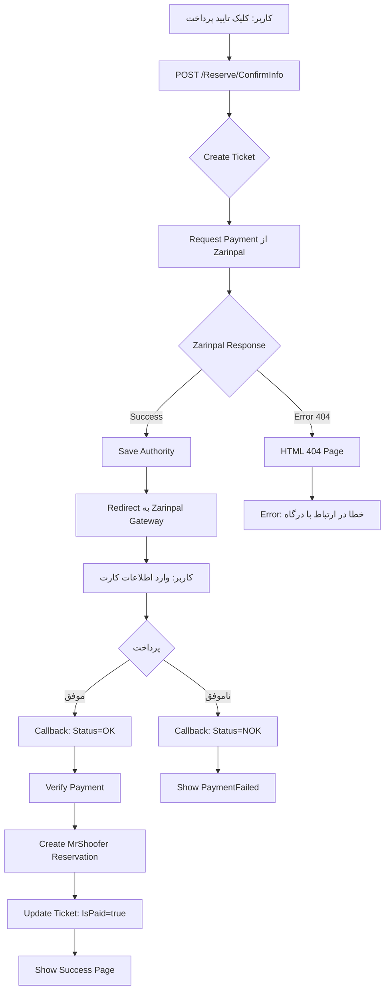

# 🔧 راهنمای کامل تنظیم Zarinpal (نسخه به‌روز)

## 🚨 مشکل فعلی: 404 Not Found

Zarinpal صفحه 404 برمی‌گردونه به دلایل زیر:
1. ❌ **URL های قدیمی** (sandbox.zarinpal.com)
2. ❌ **MerchantId placeholder** (`XXXXXXXX...`)

---

## ✅ راه‌حل: استفاده از API جدید Zarinpal

### **URLs جدید Zarinpal (2024):**

```json
{
  "Zarinpal": {
    "PaymentUrl": "https://payment.zarinpal.com/pg/v4/payment/request.json",
    "VerifyUrl": "https://payment.zarinpal.com/pg/v4/payment/verify.json",
    "PaymentGatewayUrl": "https://payment.zarinpal.com/pg/StartPay/"
  }
}
```

**⚠️ تغییرات مهم:**
- ❌ `sandbox.zarinpal.com` → ✅ `payment.zarinpal.com`
- ❌ `/WebGate/` → ✅ `/v4/payment/`
- ❌ `.json` در انتها **حتماً** نگه دار

---

## 📝 مراحل تنظیم کامل

### **گام 1: دریافت Merchant ID**

#### **روش A: ثبت‌نام در Zarinpal (توصیه می‌شود)**

1. برو به: https://www.zarinpal.com/
2. **ثبت‌نام** کن (رایگان)
3. بعد از تایید حساب، برو به **پنل پذیرنده**
4. بخش **درگاه پرداخت** → **اطلاعات پذیرنده**
5. **Merchant ID** خودت رو کپی کن

فرمت Merchant ID:
```
12345678-abcd-1234-efgh-123456789012
```

#### **روش B: استفاده از Merchant ID تستی (موقت)**

اگه فقط می‌خوای تست کنی:
```
00000000-0000-0000-0000-000000000000
```

⚠️ **نکته:** این merchant فقط برای تست محلی کار می‌کنه!

---

### **گام 2: آپدیت `appsettings.Development.json`**

```json
{
  "Zarinpal": {
    "MerchantId": "00000000-0000-0000-0000-000000000000",
    "IsSandbox": true,
    "PaymentUrl": "https://payment.zarinpal.com/pg/v4/payment/request.json",
    "VerifyUrl": "https://payment.zarinpal.com/pg/v4/payment/verify.json",
    "PaymentGatewayUrl": "https://payment.zarinpal.com/pg/StartPay/",
    "CallbackUrl": "http://localhost:5055/Payment/Verify",
    "Description": "خرید بلیط مستر شوفر - تست"
  }
}
```

---

### **گام 3: برای تست با ngrok (اختیاری)**

اگه می‌خوای callback رو تست کنی:

```sh
# 1. دانلود و نصب ngrok
# https://ngrok.com/download

# 2. اجرا
ngrok http 5055

# 3. کپی HTTPS URL
# مثال: https://abc123.ngrok-free.app

# 4. آپدیت CallbackUrl
"CallbackUrl": "https://abc123.ngrok-free.app/Payment/Verify"
```

⚠️ **بدون ngrok:** پرداخت کار می‌کنه ولی callback اجرا نمیشه!

---

## 🧪 تست Sandbox

### **شماره کارت تست:**
```
6037-9971-xxxx-xxxx
```
(هر عددی برای `x` می‌تونی بذاری)

### **سایر اطلاعات تست:**
```
CVV2: 123
تاریخ انقضا: 12/30
رمز دوم: هر عددی (مثلاً 123456)
```

---

## 📊 تفاوت Sandbox و Production

| ویژگی | Development (Sandbox) | Production |
|-------|---------------------|------------|
| **Domain** | `payment.zarinpal.com` | `payment.zarinpal.com` |
| **IsSandbox** | `true` | `false` |
| **پول واقعی** | ❌ خیر | ✅ بله |
| **Merchant** | Test Merchant | Real Merchant |
| **CallbackUrl** | ngrok یا localhost | دامنه واقعی |

---

## 🔄 جریان کامل پرداخت



---

## 🐛 عیب‌یابی

### **خطا: "404 Not Found" (HTML)**

**علت:**
- URL اشتباه
- MerchantId نامعتبر
- استفاده از `sandbox.zarinpal.com` (قدیمی)

**راه‌حل:**
```json
// ❌ اشتباه
"PaymentUrl": "https://sandbox.zarinpal.com/pg/rest/WebGate/PaymentRequest.json"

// ✅ درست
"PaymentUrl": "https://payment.zarinpal.com/pg/v4/payment/request.json"
```

---

### **خطا: "Merchant ID نامعتبر" (کد -2)**

**علت:** MerchantId placeholder هست

**راه‌حل:**
```json
// ❌ اشتباه
"MerchantId": "XXXXXXXX-XXXX-XXXX-XXXX-XXXXXXXXXXXX"

// ✅ برای تست
"MerchantId": "00000000-0000-0000-0000-000000000000"

// ✅ یا Merchant واقعی از Zarinpal
"MerchantId": "12345678-abcd-1234-efgh-123456789012"
```

---

### **خطا: "Callback unreachable"**

**علت:** localhost قابل دسترسی از Zarinpal نیست

**راه‌حل:**
1. استفاده از **ngrok**
2. یا deploy روی سرور واقعی

---

## 📱 تست سریع بدون ngrok

اگه فقط می‌خوای ببینی پرداخت کار می‌کنه:

```json
{
  "Zarinpal": {
    "MerchantId": "00000000-0000-0000-0000-000000000000",
    "CallbackUrl": "http://localhost:5055/Payment/Verify"
  }
}
```

**نتیجه:**
- ✅ صفحه Zarinpal باز میشه
- ✅ پرداخت انجام میشه
- ❌ Callback اجرا **نمیشه** (چون localhost)
- ❌ رزرو نهایی ایجاد **نمیشه**

برای تست کامل حتماً از **ngrok** استفاده کن!

---

## ✅ Checklist قبل از تست

- [ ] URLs جدید Zarinpal (v4)
- [ ] MerchantId معتبر (نه placeholder!)
- [ ] `IsSandbox: true`
- [ ] برنامه restart شده
- [ ] (اختیاری) ngrok اجرا شده
- [ ] CallbackUrl درست تنظیم شده

---

## 🔗 لینک‌های مفید

- **مستندات Zarinpal:** https://docs.zarinpal.com/
- **پنل پذیرنده:** https://panel.zarinpal.com/
- **API Reference:** https://docs.zarinpal.com/paymentGateway/guide/
- **پشتیبانی:** support@zarinpal.com

---

## 📞 در صورت مشکل

### **1. چک کردن Logs:**

```sh
# در Visual Studio Output window دنبال این‌ها بگرد:
# ✅ "Zarinpal Payment Request JSON"
# ✅ "Zarinpal Payment URL"
# ✅ "Zarinpal HTTP Status"
# ❌ "Zarinpal returned HTML"
# ❌ "404"
```

### **2. تست دستی با Postman:**

```http
POST https://payment.zarinpal.com/pg/v4/payment/request.json
Content-Type: application/json

{
  "merchant_id": "00000000-0000-0000-0000-000000000000",
  "amount": 10000,
  "description": "Test",
  "callback_url": "http://localhost/callback"
}
```

اگه این کار کرد، یعنی مشکل از کد شماست.  
اگه 404 گرفتی، یعنی URL اشتباهه.

---

**آخرین بروزرسانی:** 2024-12-16  
**API Version:** v4  
**نسخه:** 2.0
